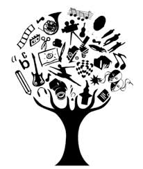

# Porque empecé a estudiar informática?

Bueno... Por donde debería empezar? Debería contarlo todo? Probablemente estas dos preguntas podrían provocar efectos adversos a los deseados, una respuesta demasiado extensa como para poder mantener el interés en la lectura y una opinión equivocada sobre el autor de este texto. 
**Empezaré desde la primera muestra de interés** que mostré en la informática o programación sin yo saberlo. *A los cinco años* me regalaron mi primera videoconsola, la Play Station 2, creo que hasta la fecha de hoy ha sido uno de los mejores regalos que me han hecho, aunque mis padres no pensaran lo mismo en ese momento. Aquel día mi sueño de ser astronauta se empezó a desvanecer y cobraba fuerza la idea de poder probar videojuegos y examinarlos, al mismo tiempo que yo también podría crear los míos propios. Aunque paso mucho tiempo y aparecieron otros intereses. 

***Acabé el instituto*** más confuso que cuando lo comencé, desconocía completamente a que me quería dedicar o que rumbo debería tomar.
Siempre me habían gustado las excursiones y la actividad física así que me decidí a empezar un grado medio Físico-deportivo. Disfruté como nunca había disfrutado hasta ese momento de ir a clase. Al acabarlo decidí realizar unos estudios Técnicos de Montaña de Nivel 1, aún no tenía los 18 y no me podía presentar al Grado Superior Físico-deportivo, pero al año siguiente conseguí plaza, y debo admitir que aunque aprendí y lo pase bien, siento que han sido dos años "malgastados". Me encontré rodeado de materia sobre dietas, fisiología muscular, rutinas de entrenamiento,... Como podéis imaginar no me gusto demasiado y al acabar tenía claro que **no** me metería en un gimnasio y si de algo me servía sería para entrenar y enseñar. De ese modo conseguí realizar las practicas como monitor de natación en sports85 y al acabar, conseguí mi primer contrato indefinido. Aunque sintiera que había malgastado dos años de mi vida las cosas no me iban del todo mal, tenía un trabajo que me gustaba, una relación estable, me acababa de comprar un Ford Focus Cmax que adoraba (era muy grande y tenía los cristales traseros tintados) y la certeza de que enseñar me agradaba y se me daba bien, o al menos eso creía yo. Aunque siempre he sido nefasto con la ortografía en Catalan, me arme de valor y me inscribí a las pruebas de acceso para Magisterio en el Cesag, las pasé y me alegré.  
*Aunque poco después las cosas cambiaron* y en el periodo de tiempo de una semana me encontré en Inglaterra, con nuevo trabajo y habitación para vivir durante mi próximo año. Aunque fue un cambio brusco, **sin duda alguna fue el mejor año de mi vida**. Fue como si todas tus imaginaciones sobre como sería viajar, conocer gente, perderte en lugares inhóspitos y sentir la libertad, pude comprobar que todo fue incluso mejor de lo que había imaginado, y me encantó. Aunque también debo admitir que fue la primera vez que me vi sin amigos, sin padres o mi hermana, nadie me podía dar consejo o guiar y a todas las opciones que se me fueron presentando accedí y cada una de ellas no fue más que una metedura de pata sino mayor que la anterior. Aunque uno con el tiempo uno va aprendiendo, a comportarse, a pensar antes de actuar, a ganarse la simpatía y conocer a los demás. *Ese año también me enamore por vez primera,*
 >siempre se ha dicho que las mejores historias de amor han surgido de los encuentros más inesperados.

 Poco después empezamos a vivir juntos, cuando acabé el contrato volvimos a Mallorca y  volví a trabajar como monitor de natación y en Octubre nos fuimos de vuelta a las inglesas, pero está vez con uno de mis amigos más cercanos. Yo vivía y y trabajaba con mi amigo, en un Castillo perdido en medio de la nada reformado como un hotel 4* de alta categoría. *Ese año* empecé a comprobar los dañinos efectos del duro trabajo mal pagado y admití la famosa frase de mis padres,
>si no estudias jamás tendrás un trabajo que te guste y te llene, al mismo tiempo que no te va a ser fácil vivir en este mundo, 

empecé a hacer una lista de todos los conocimientos que me gustaría adquirir y estudiar en consecuencia, los filtré por cuales eran los que habían tenido un mayor crecimiento de oferta laboral en los últimos años y cuan bien pagados estaban, **el campo relacionado con la informática despuntaba sobre todos los demás con diferencia**. Empecé a informarme y adquirí mi primer libro sobre programación llamado *Python Crash Course*. Pude comprobar por propia piel que me gustaba y lo más importante me despertaba interés y eso provocaba que mi curiosidad creciera.  

Poco después empezó la cuarentena, las cosas volvieron a cambiar, a finales de Junio volvía a Mallorca con la idea de estudiar y con ello tenía la esperanza de poder construirme la vida a la que aspiro, *que aunque tampoco sea cara no significa que sea barata*. Al principio me debatí entre hacer la carrera o el fp, pero al necesitar una via de sustento y admitir que no tenía conocimientos sobre programación o matemáticas decidí inscribirme en el Dual. Este es un resumen de porqué acabé matriculándome en este curso y aunque creo haberme extendido un poco más de lo necesario espero no haberos aburrido y que ahora me conozcáis un poco mejor. Para cualquier duda me invitáis a un café después de febrero.

